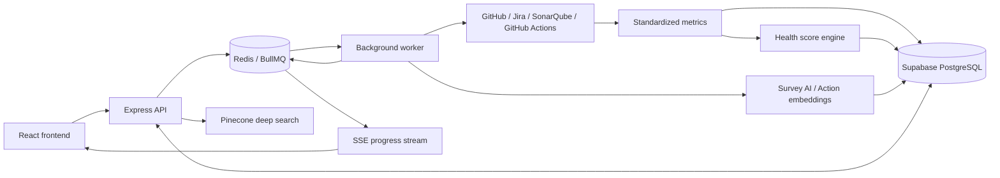

# Pulse

### Measure project health. Understand the team. Learn from every action.

[](https://github.com/Tahmidul-Islam-Omi/Capstone-Repo/actions/workflows/ci.yml)


Pulse is an engineering health platform for managers and team leads overseeing software projects. It combines metrics from development tools, anonymous team surveys, and a history of management actions so teams can identify problems, understand their causes, and evaluate what helped.

Developed as a BUET CSE capstone project.

**[Open Pulse](https://capstone-repo.vercel.app)** · **[Architecture reference](backend/docs/architecture-high-level.md)** · **[Scoring rules](backend/libs/risk-engines/scoring-rules/)**

## Contents

- [How Pulse works](#how-pulse-works)
- [Features](#features)
- [Integrations](#integrations)
- [Architecture](#architecture)
- [Technology](#technology)
- [Run locally](#run-locally)
- [Configuration](#configuration)
- [Development and checks](#development-and-checks)
- [Deployment](#deployment)
- [Repository guide](#repository-guide)

## How Pulse works

1. **Measure project health.** Collect development metrics, save snapshots, and track health scores over time.
2. **Ask the team.** Use project scores and metrics to generate focused pulse surveys, then summarize anonymous feedback.
3. **Act and learn.** Record the problem, suspected cause, and action taken. Review effectiveness later and search past actions to inform the next decision.

Monitoring continues after an action, giving the team new evidence to review alongside its feedback and action history.

## Features

| Area | What Pulse provides |
| --- | --- |
| Project portfolio | Workspaces, repository onboarding, tracked projects, and project dashboards. |
| Metric ingestion | Manual and scheduled synchronization through background jobs, with live progress over Server-Sent Events (SSE). |
| Health scoring | Seven categories: Security, Reliability, Maintainability, CI/CD & Deployment Health, Team Health, Engineering Process, and Planning & Execution. |
| Score explanations | Historical trends and breakdowns showing the signals and weights behind a score. |
| Team surveys | AI-generated questions, manual and monthly survey flows, anonymous responses, and summarized insights. |
| Survey delivery | Email and optional shared-link broadcasts to Slack, Telegram, and Discord. |
| Action history | Record actions across projects, rate effectiveness from 1–5, and defer reviews while waiting for an outcome. |
| Action search | Keyword search and an explicit **Deep Search** option using Pinecone reranking. |
| Accounts | Company accounts, admin/member roles, invitations, email verification, password reset, and cookie-based sessions. |
| Interface | Light and dark themes, charts, and progress indicators. |

Health scores use a **0–100 scale, where higher is healthier**. Available signals are normalized and weighted; missing signals are excluded and the remaining weights are adjusted. See the [scoring reference](backend/libs/risk-engines/risk-engines-reference.md) for formulas and assumptions. Scoring thresholds remain calibration choices defined in code.

Survey insights are stored separately from connector-derived health scores. Scores and raw metrics provide context for survey questions; survey answers do not overwrite those scores. Survey responses have no user identity column, and analysis and raw-text visibility require a minimum submission count, configurable through `SURVEY_MIN_ANONYMOUS_RESPONSES` (default: 5).

## Integrations

| Tool | Data collected | Status |
| --- | --- | --- |
| GitHub | Repository activity, pull requests, reviews, and ownership metrics | Implemented |
| Jira | Sprint planning, issue flow, throughput, and delivery metrics | Implemented |
| SonarQube | Code quality, coverage, maintainability, reliability, and security metrics | Implemented |
| GitHub Actions | Workflow and deployment metrics | Implemented |
| GitLab | Version-control connector scaffold | Not yet implemented |
| Linear | Project-management connector scaffold | Not yet implemented |

Configure repository access through a workspace and project-specific integrations through the application. Stored credentials are encrypted with AES-256-GCM using the backend's `ENCRYPTION_KEY`.

## Architecture

The frontend, API, and background worker run separately. Redis supports job queues, sessions, and progress events; Supabase PostgreSQL stores application data, metric snapshots, scores, surveys, and actions.



A sync request queues work and returns immediately. The worker runs the configured connectors, persists metric snapshots, calculates scores, and publishes progress for the frontend. The same worker handles scheduled syncs, survey delivery and analysis, and optional action embedding jobs.

Ordinary action searches use keyword matching. Deep Search explicitly reranks action candidates through Pinecone and reports an error if that service is unavailable. The optional Gemini embedding pipeline stores action vectors independently; the current Deep Search flow does not query those vectors.

## Technology

| Layer | Stack |
| --- | --- |
| Frontend | React 18, TypeScript, Vite, React Router, Tailwind CSS, Radix UI, MUI, Recharts |
| API | Node.js, Express, TypeScript, Supabase client |
| Background processing | BullMQ, Redis, separate worker process |
| Persistence | Supabase PostgreSQL, JSONB metric snapshots, optional vector embeddings |
| AI | Gemini for survey generation, analysis, and optional action embeddings; Pinecone for deep action search |
| Notifications | Brevo email, Slack, Telegram, Discord |
| Quality checks | ESLint, TypeScript, Vitest, Node.js test runner, GitHub Actions |
| Hosting configuration | Vercel frontend, Render API and worker, Supabase database |

## Run locally

### Prerequisites

- **Node.js 20 or newer** and npm. CI uses Node.js 20.
- **Redis**, either installed locally or started with Docker Compose.
- **A Supabase project with the Pulse schema provisioned**, plus its project URL and service-role key.
- Credentials for any development tools you want to connect.

**Database setup:** the repository contains incremental SQL changes in [backend/db/migrations](backend/db/migrations/) and [supabase/migrations](supabase/migrations/), but does not provide a complete, automated bootstrap for an empty database. Start from a provisioned Pulse database or obtain a current schema export from the project maintainers, then apply outstanding migrations in their intended order. Files in `backend/db/schema/` and `backend/apps/api/database/schema.sql` are reference dumps, not executable setup scripts.

### 1. Clone and install

```bash
git clone https://github.com/Tahmidul-Islam-Omi/Capstone-Repo.git
cd Capstone-Repo
npm ci --prefix backend
npm ci --prefix frontend
```

### 2. Configure the environment

```bash
cp backend/.env.example backend/.env
cp frontend/.env.example frontend/.env
```

Update `backend/.env` with your Supabase credentials, Redis URL, and encryption keys. Generate **two independent keys**, one for `ENCRYPTION_KEY` and one for `SURVEY_TOKEN_ENC_KEY`, by running this command twice:

```bash
node -e "console.log(require('node:crypto').randomBytes(32).toString('base64url'))"
```

Use these local values in `backend/.env` alongside your credentials:

```dotenv
NODE_ENV=development
PORT=3000
WORKER_PORT=4000
REDIS_URL=redis://localhost:6379
FRONTEND_ORIGIN=http://localhost:5173
FRONTEND_URL=http://localhost:5173
SURVEY_FORM_BASE_URL=http://localhost:5173/survey
```

Set `frontend/.env` to:

```dotenv
VITE_API_BASE_URL=/api/v1
```

Vite proxies `/api` to `http://localhost:3000`, keeping browser requests and session cookies on the frontend origin.

### 3. Start Redis

From the repository root:

```bash
docker compose up -d redis
```

### 4. Start the application

Run each command in a **separate terminal**, from the repository root:

```bash
# API
npm run dev --prefix backend
```

```bash
# Background worker
npm run dev:worker --prefix backend
```

```bash
# Frontend
npm run dev --prefix frontend
```

| Service | Local address |
| --- | --- |
| Frontend | http://localhost:5173 |
| API | http://localhost:3000/api/v1 |
| API health | http://localhost:3000/api/v1/health |
| Worker health | http://localhost:4000/health |

Keep both the API and worker running: queued sync and survey jobs need the worker to complete.

### 5. Verify and create your first project

```bash
curl http://localhost:3000/api/v1/health
curl http://localhost:4000/health
```

The API response should report `services.supabase.status` as `connected`. Its top-level `status: "ok"` alone does not confirm database connectivity.

Open the frontend, register your company account, create a GitHub workspace, and add a repository. Connect any additional tools, then trigger a sync to populate the dashboard. Without `BREVO_API_KEY`, verification codes and email links are logged by the API for local development instead of being emailed.

## Configuration

The [backend environment template](backend/.env.example) documents survey, embedding, and search settings. Some additional settings used by the application are listed below.

| Variable | Purpose |
| --- | --- |
| `SUPABASE_URL`, `SUPABASE_SERVICE_ROLE_KEY` | Backend database access; keep the service-role key on the server. |
| `DATABASE_URL` | PostgreSQL connection string for database tooling and configuration validation. |
| `REDIS_URL` | Shared connection for API sessions, queues, and worker progress. |
| `ENCRYPTION_KEY` | Encrypts stored integration credentials; 32 bytes encoded as base64url. |
| `SURVEY_TOKEN_ENC_KEY` | Encrypts public survey-link tokens; a separate 32-byte base64url key. |
| `GEMINI_API_KEY` | Enables AI survey generation and analysis, plus optional action embeddings. |
| `PINECONE_API_KEY` | Enables the explicit Deep Search feature. |
| `BREVO_API_KEY`, `EMAIL_FROM` | Sends transactional and survey email; the sender must be verified in Brevo. |
| `SLACK_BOT_TOKEN`, `SLACK_CHANNEL_ID` | Optional survey broadcast to a Slack channel. |
| `TELEGRAM_BOT_TOKEN`, `TELEGRAM_CHAT_ID` | Optional survey broadcast to a Telegram group or channel. |
| `DISCORD_WEBHOOK_URL` | Optional survey broadcast to a Discord channel. |
| `FRONTEND_ORIGIN`, `FRONTEND_URL` | Allowed browser origin and the frontend URL used in email links. |
| `SURVEY_FORM_BASE_URL` | Base URL for public survey links. |
| `SCHEDULED_SYNC_ENABLED` | Enables scheduled syncs by default; set to `false` to disable. |
| `SCHEDULED_SYNC_TIMES`, `SCHEDULED_SYNC_TZ` | Comma-separated `HH:MM` sync times and IANA time zone; defaults to `02:00` in `UTC`. |
| `APP_DISPLAY_TZ` | Dashboard date display time zone; defaults to the scheduling time zone. |

API and worker services must use the same database, Redis instance, and encryption keys. Local `.env` files are ignored by Git; put only public configuration in frontend `VITE_*` variables.

## Development and checks

Run from the repository root:

```bash
# Backend: types, lint, build, and both test runners
npm run typecheck --prefix backend
npm run lint --prefix backend
npm run build --prefix backend
npm test --prefix backend
npm run test:actions --prefix backend

# Frontend: types, lint, and production build
npm run typecheck --prefix frontend
npm run lint --prefix frontend
npm run build --prefix frontend
```

`npm run test:coverage --prefix backend` runs the Vitest suite with coverage. The [CI workflow](.github/workflows/ci.yml) runs relevant checks for backend and frontend changes and exposes the combined `ci-ok` check.

For optional action embeddings, run `npm run backfill:action-embeddings --prefix backend -- --dry-run` to inspect pending work before backfilling. Live connector verification scripts are separate from the unit tests and require valid tool credentials.

When contributing, keep changes focused, run the relevant checks, and update documentation when behavior or configuration changes.

## Deployment

- **Frontend:** deploy `frontend/` with `npm run build` and publish `dist/`. The [Vercel configuration](frontend/vercel.json) proxies `/api/*` to the configured Render API and routes other paths to the SPA. Update the API destination for your deployment; production requests use `/api/v1` on the frontend origin.
- **API:** use the image defined by [backend/Dockerfile](backend/Dockerfile). Its default command starts `apps/api/server.ts` with `tsx`.
- **Worker:** deploy the same image as a separate service with command `node --import tsx apps/worker/worker.ts`. A compiled deployment can instead use `npm run build`, followed by `npm start` or `npm run start:worker` in separate services.
- **Shared services:** provision Redis and Supabase, configure both backend services, and set frontend and survey URLs to the deployed HTTPS origin.

The local instructions above use Docker Compose for **Redis only**. The Compose worker definition still references the old `apps/worker/src/worker.ts` path; use the documented npm worker command for local development.

## Repository guide

```text
Capstone-Repo/
├── frontend/
│   └── src/app/          Pages, components, hooks, and API clients
├── backend/
│   ├── apps/api/         Express routes, controllers, services, and database access
│   ├── apps/worker/      Background workers and job processors
│   ├── libs/             Connectors, scoring, AI, queues, authentication, and security
│   ├── db/               Schema references and earlier migrations
│   ├── scripts/          Connector verification and maintenance scripts
│   └── tests/            Action search, embedding, and reranking test suites
├── supabase/migrations/  Timestamped database changes
├── .github/workflows/    CI configuration
└── docker-compose.yml    Local service definitions
```

| Reference | Contents |
| --- | --- |
| [Architecture](backend/docs/architecture-high-level.md) | Runtime flow, queues, workers, connectors, persistence, and SSE |
| [Class and interface reference](backend/docs/class-and-interface-reference.md) | Backend contracts and relationships |
| [Scoring reference](backend/libs/risk-engines/risk-engines-reference.md) | Score calculation, normalization, and missing-input handling |
| [Scoring rules](backend/libs/risk-engines/scoring-rules/) | Category-specific formulas and weights |
| [Survey reference](backend/survey.md) | Survey lifecycle, scheduling, delivery, and analysis |
| [GitHub token permissions](backend/instructions/GITHUB_TOKEN_PERMISSIONS.md) | Connector access requirements |
| [Jira token permissions](backend/instructions/JIRA_TOKEN_PERMISSIONS.md) | Jira connector access requirements |
| [Project context](context.md) | Detailed technical handoff |

Some reference documents retain earlier design details. For current startup commands and integration status, use this README and the package scripts; implementation files define the current behavior.
